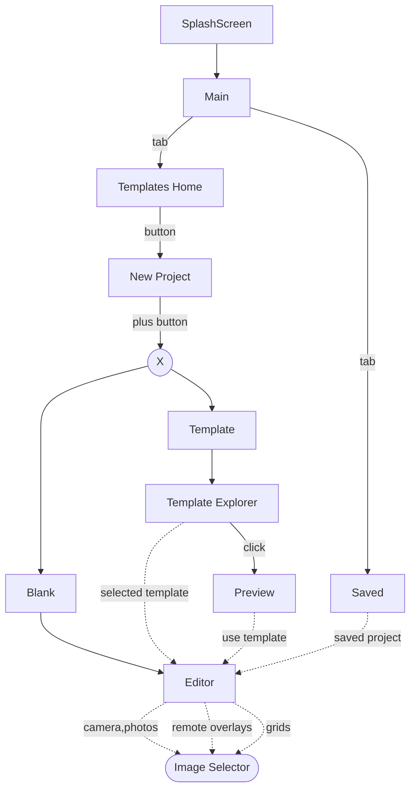

# 2. UI Navigation

Date: 2025-05-21

## Status

Accepted

## Context

## Decision

Implement: 
- splashscreen
- several activities (Home, Editor, Template Explorer, Preview)
- integrate system provided (image selector)
- dialogs (TBD... Yes/No confirmations)

## Consequences

- use Jetpack Navigation Component for creating a navigation graph
- compose minimalistic Activities and Fragments
- prepare for usage ViewModel, Lifecycle, LiveData, etc.
- Architecture: MVVM or MVI
- Use Jetpack Compose for UI
- Configure gradle to a specific version of Jetpack libraries as dependency
- Set specific Jetpack compose version in `gradle/libs.versions.toml` file

## References

- https://developer.android.com/jetpack/androidx/releases/core
- 