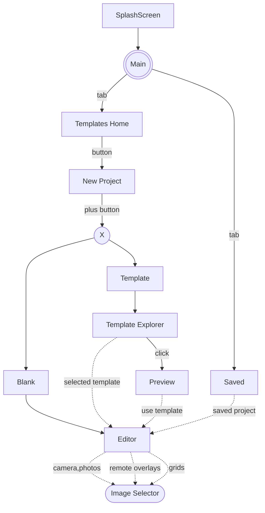

# 6. UI Navigation

Date: 2025-05-23

## Status

Accepted

## Context

Compose application UI navigation experience.

## Decision

Implement Material UI design, based on components: https://developer.android.com/develop/ui/compose/components

UI:
- SplashScreen (https://developer.android.com/develop/ui/views/launch/splash-screen#kts)

Activities:
- MainActivity:
  - Scaffold Layout
  - Tabs Control with 2 tabs: "Templates Home" and "Saved" (on the bottom of the screen)
  - Tab "Templates Home":
    - Horizontal List of Templates by Category (implement as "skeleton")
    - Button to Create New Project (display Selection View/Panel)
    - Vertical Grid/List of popular shared projects by other people (implement as "skeleton")
  - Tab "Saved":
    - Vertical Grid/List with created by user project with preview of the project state (implement as "skeleton")
  - floating action button to create new project "+" 
  - Selection View/Panel (implemented as Bottom sheet):
    - Two buttons: Blank and From Template 
    - On button "Blank" click navigate to Editor activity
    - On button "From Template" click navigate to "Template Explorer" activity
- Editor Activity
  - blank activity for now 
- Template Explorer Activity
  - vertical grid the same as used for displaying "popular shared projects" but on full width/height of activity
  - on grid item click - navigate user to "Preview" activity
  - each cell should contains: Preview Image, bottom bar with details: title, number of images, number of slides, author and button "Use Template"
    - on button click - navigate user to "Editor" activity with parameter "selected template"
- Preview Activity
  - simulate aka Instagram preview of the done Project
  - display first slide, on the max-width and 70% of height
  - on bottom display navigation controls: prev, next, play (stop), save as image

## Consequences

- Use Telephoto ZoomableImage for displaying images
- Use Compose UI for all elements
- add dependencies: icons libraries (`androidx.compose.material:material-icons-core`, `androidx.compose.material:material-icons-extended`)
- add dependencies: `androidx.compose.material3:material3`
- add navigation component: `androidx.navigation:navigation-compose`
- add dependency: `androidx.navigation:navigation-safe-args-gradle-plugin`

## References

- https://developer.android.com/guide/navigation
- https://developer.android.com/guide/navigation/use-graph/pass-data#Safe-args