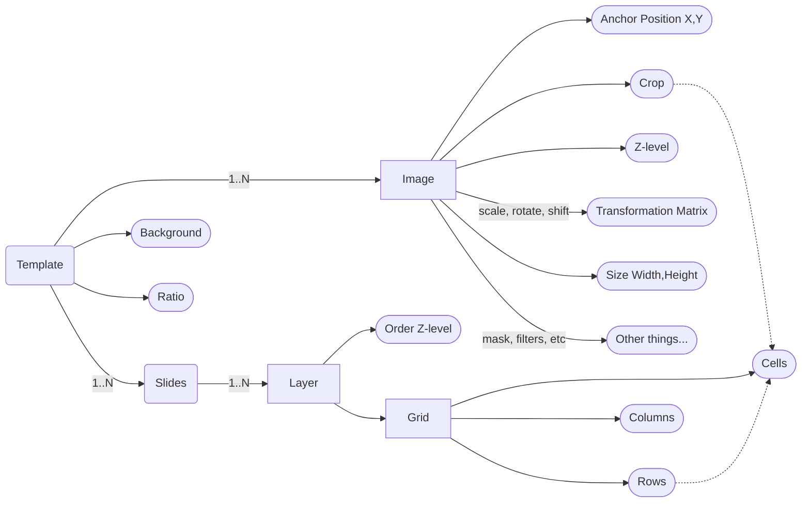

# 7. Sclr Document Structure

Date: 2025-05-23

## Status

Accepted

## Context

To define the templates and how they will be used in app we need a flexible data structure.

Major features that data structure should support:

- [ ] Template with one or more slides;
  - [ ] Template support different Ratio: landscape (16:9), portrait (4:3), square (1:1);
- [ ] Each slide may have one or more layers;
- [ ] Each Layer support multiple Grids (Grid with predefined number of rows and columns, cells);
  - [ ] Max Grid size is 12x12 (but for user is available only grids with max 4x4); 
- [ ] Each Layer support different types of Layers: Image, Sticker, Frame, Text, Grid;
- [ ] User can edit the cell width, row heights;
- [ ] User can configure the white space between cells, rows and columns; space between layer and grid;

~~Grid cell supports nesting of another Grid;~~

## Decision

Entities:
- Template (or Canvas)
- Slide
- Image
- Grid, Row, Column, Cell
- Layer

Sticker, Frame, Text - can be represented as Text-Image with different properties configuration.

Slides are stacked from left-to-right, increasing the canvas width.

Application has predefined Grids (26 preconfigured rows, columns, cells). 

Image can be rendered in scope/crop of cell, or have own defined Crop path;

Image can cross the logical borders of Slide and be rendered on multiple slides;

Each element of the Template should be selectable on screen; Can be selected multiple elements;

## Consequences

- Filled document/template/canvas saved as JSON document. We should use Moshi for serialization.
- Each project requires a sub-folder, in which we keep all used images (originals).
- All entities has properties of two kinds: configuration and rendering specifics.
  - Configuration: defined document structure, content;
  - Rendering: defines how the entity is rendering itself on canvas;
- Document should be saved on disk with thumbnail image (preview of the template);
- Thumbnails can be two types: cover (used for shared templates) and thumbnail which reflect the current state of the document.
  - During sharing we generate cover image;
- `SavedProjectsRepository` abstraction will be responsible for disk operations;
