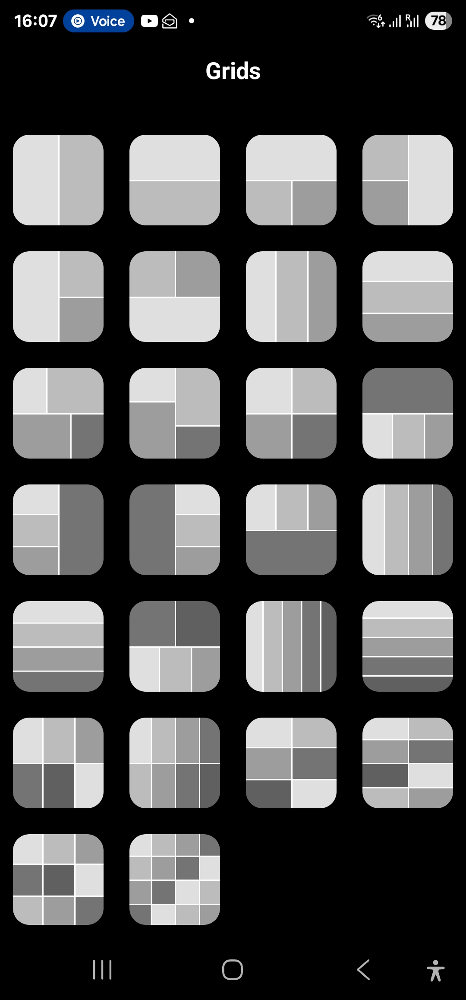
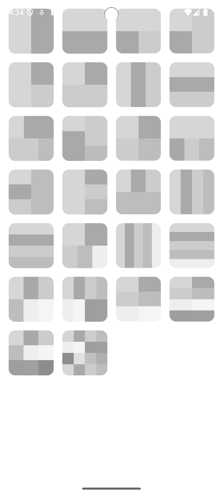

# 10. Predefined Grids

Date: 2025-05-27

## Status

Accepted

## Context

During Document editing user can select one of the predefined grids as a Layer.

## Decision

| Original                    | Implementation                   |
|-----------------------------|----------------------------------|
|  |  |

1. Compose 26 grids:
   1. 1 row, 2 columns 50/50
   2. 2 rows 50/50, 1 column
   3. 2 rows 50/50, 2 columns 50/50, first row - one cell, second row - two cells 50/50
   4. 2 rows, 2 columns, first column - two cells, second column - one cell
   5. 2 rows, 2 columns, first column - one cell, second column - two cells
   6. 2 rows, 2 columns, first row - two cells, second row - one cell
   7. 3 columns
   8. 3 rows
   9. 2 columns, 2 rows, cells proportions: row 1 - 30/70, row 2 - 70/30
   10. 2 columns, 2 rows, cells proportions: column 1 - 30/70, column 2 - 70/30
   11. 2 columns, 2 rows, 2 cells in each row, 50/50
   12. 2 rows, 3 columns. first row - one cell, second row - three columns/cells, 33/33/33
   13. 2 columns, 3 rows, first column - three cells 33/33/33, second column - one cell
   14. 2 columns, 3 rows, first column - one cell, second column - three cells 33/33/33
   15. 2 rows, 3 columns, first row - three cells 33/33/33, second row - one cell
   16. 4 columns, 1 row
   17. 4 rows, 1 column
   18. 5 cells, 2 rows, 3 columns. 2 cells in first row 50/50, 3 cells in second row 33/33/33
   19. 5 columns
   20. 5 rows
   21. 2x3 Rows x Columns
   22. 2x4 Rows x Columns
   23. 3x2 Rows x Columns
   24. 2x4 Rows x Columns
   25. 3x3 rows x Columns
   26. 4x4 rows x Columns

2. Each cell should be displayed in template with a gray color (unique color for each cell)
3. Grids displayed as Bottom Sheet with grid, 4 columns
4. Grids bottom sheet visible only in Editor Screen (on Select Grids button click)
5. Naming Convention, pattern: `${NumberOfRows}Rows[_${Proportions}]_${NumberOfColumns}Columns[_${Proportions}]_${Uniqueness}`
   1. Proportions skipped if we occupy 100%
   2. Number of columns and Rows we write in Text, ex: One, Two, Three...
   3. `_` underscore used as a separator
   4. Proportions: `${Number}[_${Number}]+`, minimum 2 numbers, max - 12
   5. `[]` - means optional
   6. `${}` - means replace by value
   7. Uniqueness - specify what make this grid configuration unique.

## Consequences

- use ConstraintLayout for Compose to make grid layouts possible.
- dependency `androidx.constraintlayout.compose`

Example:

```kotlin
// correspond Grid #9.
@Composable
fun TwoByTwoCustomGrid() {
   ConstraintLayout(
      modifier = Modifier
         .fillMaxWidth()
         .aspectRatio(1f) // Makes grid square for simplicity
   ) {
      val (cell1, cell2, cell3, cell4) = createRefs()

      // Vertical Guidelines for Columns
      val col1 = createGuidelineFromStart(0f)
      val col2 = createGuidelineFromStart(0.5f)
      val col3 = createGuidelineFromStart(1f)

      // Horizontal Guidelines for Rows (custom row proportions!)
      val row1 = createGuidelineFromTop(0f)
      val row2 = createGuidelineFromTop(0.3f)  // First row: 30%
      val row3 = createGuidelineFromTop(1f)    // Second row: 70%

      Box(
         modifier = Modifier
            .background(Color.Gray)
            .constrainAs(cell1) {
               top.linkTo(row1)
               bottom.linkTo(row2)
               start.linkTo(col1)
               end.linkTo(col2)
            }
      )

      Box(
         modifier = Modifier
            .background(Color.LightGray)
            .constrainAs(cell2) {
               top.linkTo(row1)
               bottom.linkTo(row2)
               start.linkTo(col2)
               end.linkTo(col3)
            }
      )

      Box(
         modifier = Modifier
            .background(Color.DarkGray)
            .constrainAs(cell3) {
               top.linkTo(row2)
               bottom.linkTo(row3)
               start.linkTo(col1)
               end.linkTo(col2)
            }
      )

      Box(
         modifier = Modifier
            .background(Color.Blue)
            .constrainAs(cell4) {
               top.linkTo(row2)
               bottom.linkTo(row3)
               start.linkTo(col2)
               end.linkTo(col3)
            }
      )
   }
} 
```